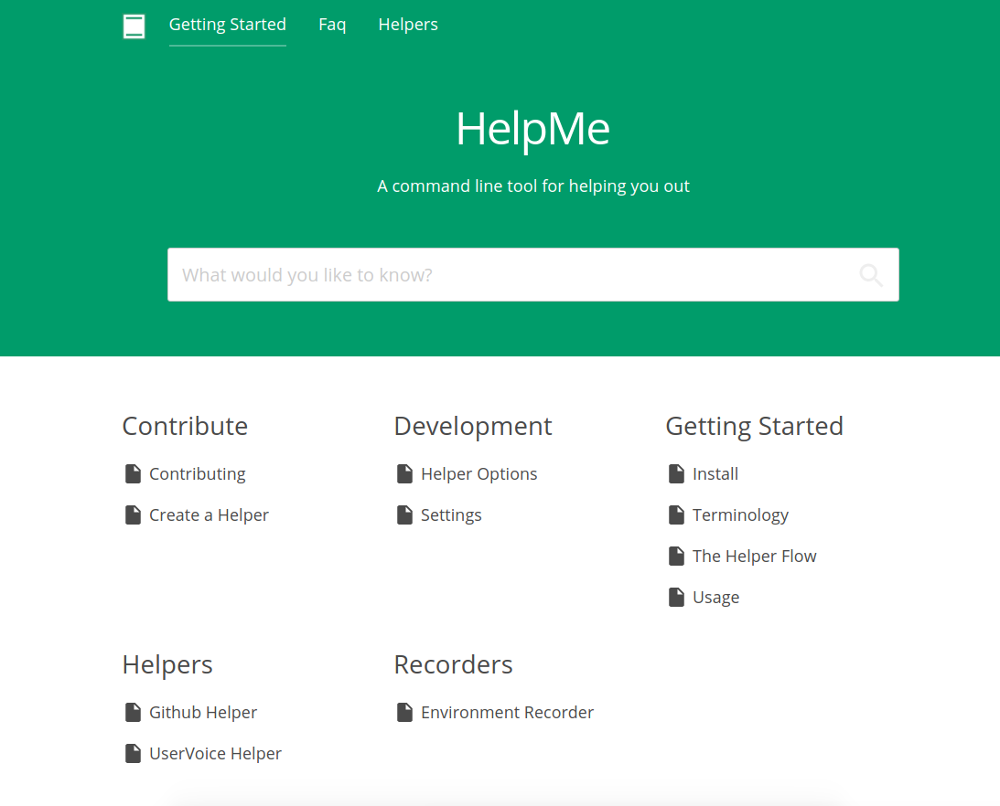

# HelpMe

A command line helper when you need it.

HelpMe is a free to use, open source command line tool that serves one purpose: to connect a user on a command line to a a resource to get help. The software provides a general framework for developers to add "helpers," or different support endpoints to work with "recorders," each a specific way of capturing information like messages, terminal recordings (asciinema), and environment, to easily submit to the endpoint. Importantly, the complex interaction of various application programming interfaces (APIs) with the user's terminal is presented in a simple and intuitive way that puts the user in control of the interaction. By default, the software comes ready to use for interaction with Github and the UserVoice ticketing softwarecommonly used in Research Computing.  The HelpMe [documentation base](https://vsoch.github.io/helpme) is rendered from the same repository and open for contribution. It provides ample detail for developers to add new helpers, recorders, and for users to install the software. For more details, please see the [paper](paper/paper.md).



## Docker

```bash
docker build -t vanessa/helpme .
```

### Interactive Development

```bash
docker run -it --entrypoint bash vanessa/helpme
```

# Overview
HelpMe is a general tool that can support the addition of helpers, or different
modules that have a set of metadata to collect for the user, and based on an internal
configuration file to define these metadata, and (if needed) an external config file
for user variables, we send help requests to the various helpers. For example:

 - `helpme github` posts an issue on a Github board
 - `helpme uservoice` creates a ticket on uservoice

We are fresh out of the oven! Please [post issues](https://www.github.com/vsoch/helpme/issues)
with questions, feedback, or just to say hello. Hello!

# Usage

```bash

# Post an issue to a Github Repo.
$ helpme github vsoch/helpme

# Post a ticket to UserVoice
$ helpme uservoice
```

For more details, see our [documentation](https://vsoch.github.io/helpme).

## License

This code is licensed under the Affero GPL, version 3.0 or later [LICENSE](LICENSE).
